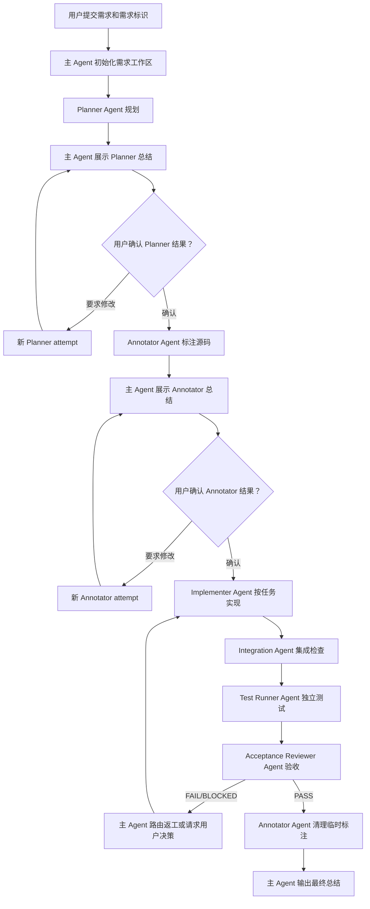

# Annocode 多 Agent 工作流交互示例

本文通过一个完整示例，说明 Annocode 工作流中：

- 每个阶段用户会看到什么；
- 用户需要进行什么操作；
- 主 Agent 和职能子 Agent 在内部执行什么；
- 每个阶段会产生哪些可追溯结果；
- Planner 和 Annotator 的强制人工确认如何生效。

> 示例需求：为评论管理后台增加“按筛选条件导出 CSV”功能。
>
> 需求标识：`feature-comment-csv-export`

## 一、流程总览



## 二、步骤 0：用户发起需求

### 用户与主 Agent 的交互

用户输入：

```text
使用 $annocode-feature-orchestrator 开始需求。

需求标识：feature-comment-csv-export

需求：
在评论管理后台增加 CSV 导出功能。导出内容必须遵循当前筛选条件，
包含评论 ID、作者、内容、评分、创建时间。导出操作只能由管理员执行。
```

### 内部执行

主 Agent 只负责初始化和编排，不直接分析代码或实现功能：

1. 验证需求标识是否符合 `[a-z][a-z0-9-]{2,63}`；
2. 检查该标识是否已关联其他需求；
3. 创建 `.annocode/requirements/feature-comment-csv-export/`；
4. 将用户原始需求原样保存到 `REQUEST.md`；
5. 初始化 `MANIFEST.md`、`PROTOCOL.md`、任务文件、handoff 文件和审批日志；
6. 创建一个全新、无主聊天历史的 Planner Agent。

### 阶段结果

```text
Status: INITIALIZED
Current phase: INIT
Expected next role: planner
```

主要产物：

```text
.annocode/requirements/feature-comment-csv-export/
├── REQUEST.md
├── MANIFEST.md
├── PROTOCOL.md
├── USER-APPROVALS.md
├── 10-plan.md
├── 20-task-board.md
├── 30-annotations.md
├── 40-integration.md
├── 50-test-report.md
├── 60-acceptance.md
├── 70-final.md
├── tasks/
└── handoffs/
```

## 三、步骤 1：Planner Agent 执行规划

### 用户看到什么

Planner 执行期间通常不需要用户操作。主 Agent可以报告：

```text
Planner Agent A1 已启动，正在分析需求、代码影响面和任务依赖。
```

### 内部执行

Planner Agent 使用独立上下文，仅通过需求标识读取：

- `REQUEST.md` 中的原始需求；
- 仓库源码和已有测试；
- `PROTOCOL.md` 中的角色边界。

Planner 负责：

1. 解释需求边界；
2. 找到相关前端、后端、权限和测试模块；
3. 编写可验证的验收标准；
4. 拆分任务 DAG；
5. 为任务分配互不冲突的文件所有权；
6. 标明风险、开放决策和测试要求；
7. 写入 Planner handoff 后结束。

Planner 不修改业务源码。

### 示例内部结果

假设 Planner 拆出以下任务：

| 任务 | 内容 | 依赖 | 文件所有权示例 |
|---|---|---|---|
| T001 | 后端 CSV 导出服务和权限校验 | 无 | `backend/services/export*`、相关测试 |
| T002 | 导出 API 路由和参数校验 | T001 | `backend/routes/comments*`、相关测试 |
| T003 | 管理后台导出按钮和下载交互 | T002 | `frontend/views/comments*`、相关测试 |

Planner 写入：

- `10-plan.md`；
- `20-task-board.md`；
- `tasks/T001.md`、`tasks/T002.md`、`tasks/T003.md`；
- `handoffs/01-planner-to-annotator.md`。

handoff 状态变为：

```text
Role: planner
Attempt: A1
Status: COMPLETE
```

## 四、步骤 2：Planner 结果强制人工确认

这是第一个强制暂停点。Planner 完成并不代表 Annotator 可以自动启动。

### 主 Agent 向用户展示的总结示例

```text
Planner A1 已完成，当前工作流已暂停，等待你的确认。

需求理解：
- 在评论管理后台按当前筛选条件导出 CSV。
- 字段包括评论 ID、作者、内容、评分和创建时间。
- 仅管理员能够访问导出接口和触发导出。

验收标准：
1. 导出结果与当前筛选条件一致。
2. CSV 表头、字段顺序和字符编码符合约定。
3. 非管理员请求返回权限错误。
4. 前端能正确下载文件并展示失败提示。
5. 后端和前端相关测试全部通过。

任务 DAG：
T001 后端导出服务 → T002 API 路由 → T003 前端下载交互

风险和开放决策：
- 大数据量导出是否需要流式响应；
- CSV 是否使用 UTF-8 BOM 兼容 Excel；
- 评论内容中的换行、逗号和双引号需要正确转义。

建议：使用流式响应并输出 UTF-8 BOM。

请确认 Planner A1 的方案。回复“确认”后才会启动 Annotator；
也可以指出需要修改的内容。
```

### 用户确认的情况

用户输入：

```text
确认 Planner A1，使用流式响应和 UTF-8 BOM。
```

主 Agent 内部执行：

1. 将原始确认文本追加到 `USER-APPROVALS.md`；
2. 记录阶段为 `PLANNER`、attempt 为 `A1`；
3. 将决定记录为 `APPROVED`；
4. 更新 `MANIFEST.md`；
5. 授权启动 Annotator。

示例审批记录：

```text
Decision: APPROVED
Stage: PLANNER
Attempt: A1
Authorized next role: annotator
User confirmation text: 确认 Planner A1，使用流式响应和 UTF-8 BOM。
```

### 用户要求修改的情况

用户也可以输入：

```text
暂不确认。单次导出最多允许 10 万条，并把这个限制加入验收标准。
```

此时主 Agent：

1. 记录 `REVISION_REQUESTED`；
2. 不创建 Annotator；
3. 创建新的 Planner Agent，attempt 为 `A2`；
4. Planner A2 修改计划和 handoff；
5. 主 Agent再次展示总结；
6. 用户必须重新确认 Planner A2。

Planner A1 的确认不能授权 Planner A2，沉默或无关回复也不能视为确认。

## 五、步骤 3：Annotator Agent 标注源码

只有 Planner 对应 attempt 已明确确认并记录后，主 Agent 才会创建 Annotator。

### 用户看到什么

```text
Planner A1 已确认。Annotator Agent A1 已启动，正在按任务契约定位并标注源码。
```

### 内部执行

Annotator Agent读取：

- 已确认的 Planner handoff；
- `10-plan.md` 和任务契约；
- Planner 指定的代码范围；
- 仓库当前源码。

Annotator 负责：

1. 将每个任务映射到准确文件和符号；
2. 在允许的位置插入可追踪临时注释；
3. 记录不能或不应插入注释的豁免位置；
4. 检查任务文件所有权是否与源码位置一致；
5. 为 Implementer 提供最小、明确的输入；
6. 写入 Annotator handoff 后结束。

Annotator 不实现功能，也不替 Implementer 修改业务逻辑。

### 示例内部结果

```text
T001:
- backend/services/comment_export.py:create_comment_csv
- backend/tests/test_comment_export.py

T002:
- backend/routes/comments.py:export_comments
- backend/tests/test_comment_routes.py

T003:
- frontend/src/views/comments/CommentList.vue
- frontend/src/api/comments.ts
```

主要产物：

- 源码中的临时任务标注；
- `30-annotations.md`；
- `handoffs/02-annotator-to-orchestrator.md`。

handoff 状态：

```text
Role: annotator
Attempt: A1
Status: COMPLETE
```

## 六、步骤 4：Annotator 结果强制人工确认

这是第二个强制暂停点。Annotator 完成后不能直接启动 Implementer。

### 主 Agent 向用户展示的总结示例

```text
Annotator A1 已完成，当前工作流已暂停，等待你的确认。

任务标注覆盖：
- T001：已定位后端导出服务及单元测试位置。
- T002：已定位评论导出路由、权限校验和路由测试位置。
- T003：已定位评论列表、API 客户端和前端测试位置。

涉及文件和符号：
- backend/services/comment_export.py
- backend/routes/comments.py
- backend/tests/test_comment_export.py
- backend/tests/test_comment_routes.py
- frontend/src/views/comments/CommentList.vue
- frontend/src/api/comments.ts

豁免项：
- 自动生成的路由类型文件不插入临时注释，将由构建流程更新。

阻塞：
- 无。

Implementer 输入：
- T001 和 T002 不得修改前端文件；
- T003 不得修改后端服务实现；
- CSV 转义、UTF-8 BOM、10 万条限制和管理员权限必须有测试覆盖。

请确认 Annotator A1 的源码覆盖方案。回复“确认”后才会启动 Implementer；
也可以指出遗漏或错误位置。
```

### 用户确认

```text
确认 Annotator A1，可以开始实现。
```

主 Agent 将确认追加到 `USER-APPROVALS.md`：

```text
Decision: APPROVED
Stage: ANNOTATOR
Attempt: A1
Authorized next role: implementer
User confirmation text: 确认 Annotator A1，可以开始实现。
```

随后才允许创建 Implementer Agent。

### 用户要求补充标注

```text
暂不确认。还需要检查导出操作的审计日志模块。
```

主 Agent会记录修改请求并创建 Annotator A2。Annotator A2 完成后必须再次总结并取得新的人工确认。

## 七、步骤 5：Implementer Agent 实现任务

### 用户交互

Planner 和 Annotator 均确认后，后续正常流水线默认自动推进。主 Agent可以报告：

```text
Annotator A1 已确认。开始执行第一波 Implementer：T001。
```

用户通常不需要逐任务确认，除非出现需求歧义、权限审批或外部依赖问题。

### 内部执行

每个任务和每次 attempt 都使用新的 Implementer Agent：

```text
feature-comment-csv-export / implementer / T001 / A1
feature-comment-csv-export / implementer / T002 / A1
feature-comment-csv-export / implementer / T003 / A1
```

每个 Implementer 只能修改任务契约分配给自己的文件范围，并负责：

- 实现限定功能；
- 添加或更新任务范围内的测试；
- 执行定向验证；
- 记录修改文件、命令、结果、风险和下一步；
- 写入独立 handoff 后结束。

示例结果：

```text
T001/A1: COMPLETE
- 实现流式 CSV 生成器；
- 增加 UTF-8 BOM；
- 正确转义逗号、引号和换行；
- 单元测试通过。

T002/A1: COMPLETE
- 增加管理员权限校验；
- 增加 10 万条上限；
- 路由测试通过。

T003/A1: COMPLETE
- 增加导出按钮；
- 复用当前筛选参数；
- 完成文件下载和错误提示；
- 前端定向测试通过。
```

交接文件示例：

```text
handoffs/implementers/T001-A1.md
handoffs/implementers/T002-A1.md
handoffs/implementers/T003-A1.md
```

## 八、步骤 6：Integration Agent 集成检查

### 用户交互

正常情况下无需用户确认：

```text
所有必需 Implementer 任务已完成，正在进行独立集成检查。
```

### 内部执行

Integration Agent 不修改实现，只检查：

- 所有计划任务是否均有 COMPLETE handoff；
- 文件修改是否越过所有权边界；
- 前后端参数和接口是否一致；
- 任务依赖是否完整；
- 是否存在漏实现、冲突或无法测试的部分；
- 是否达到 `READY_FOR_TEST`。

结果写入：

- `40-integration.md`；
- `handoffs/03-integration-to-test.md`。

示例结果：

```text
Status: READY_FOR_TEST
Scope conflicts: none
Missing required tasks: none
Interface mismatch: none
```

如果发现实现缺陷，Integration 不自行修代码。主 Agent会把问题路由给对应任务的新 Implementer attempt。

## 九、步骤 7：Test Runner Agent 独立测试

### 用户交互

```text
集成检查通过，Test Runner Agent 已启动。
```

### 内部执行

Test Runner Agent 根据 Planner 的测试要求和 Integration handoff 独立执行：

- 后端定向单元测试；
- API 集成测试；
- 前端组件测试；
- 构建或类型检查；
- 必要的回归测试。

Test Runner 不修改实现。

示例测试报告：

```text
Backend unit tests: 18 passed
API integration tests: 7 passed
Frontend component tests: 9 passed
Type check: passed
Production build: passed
Regression tests: 42 passed
Status: TESTS_COMPLETE
```

结果写入：

- `50-test-report.md`；
- `handoffs/04-test-to-acceptance.md`。

## 十、步骤 8：Acceptance Reviewer Agent 验收

### 用户交互

正常情况下无需用户操作：

```text
独立测试已完成，Acceptance Reviewer Agent 正在逐项核对原始需求和验收标准。
```

### 内部执行

Acceptance Reviewer 使用干净上下文读取：

- 原始 `REQUEST.md`；
- Planner 验收标准；
- Integration 摘要；
- Test Runner 的可复现证据；
- 各任务 handoff。

它不实现代码、不修改测试，也不代替用户改变需求。

示例结果：

```text
Decision: PASS

AC1 筛选条件一致：PASS
AC2 CSV 字段和编码：PASS
AC3 管理员权限：PASS
AC4 前端下载和错误提示：PASS
AC5 自动化测试与构建：PASS
```

结果写入：

- `60-acceptance.md`；
- `handoffs/05-acceptance-to-orchestrator.md`。

### FAIL 或 BLOCKED 的处理

- 实现缺陷：创建对应 Implementer 的新 attempt；
- 规划缺口：创建新的 Planner attempt，并在完成后重新要求 Planner 人工确认；
- 标注缺口：创建新的 Annotator attempt，并在完成后重新要求 Annotator 人工确认；
- 需求歧义：状态设为 `BLOCKED`，主 Agent向用户提出具体问题。

## 十一、步骤 9：清理标注并完成汇报

### 内部执行

Acceptance 为 PASS 后：

1. 创建一个新的 Annotator Agent；
2. 清理由工作流插入的临时源码注释；
3. 保留 `.annocode/requirements/<requirement-id>/` 下的审计记录；
4. 主 Agent写入 `70-final.md`；
5. 更新 `MANIFEST.md` 为完成状态。

### 主 Agent 最终向用户汇报的示例

```text
需求 feature-comment-csv-export 已完成并通过验收。

交付结果：
- 支持按当前筛选条件导出评论 CSV；
- 仅管理员可执行；
- 使用流式响应和 UTF-8 BOM；
- 单次最多导出 10 万条；
- 前端支持下载和错误反馈。

任务结果：
- T001/A1：COMPLETE
- T002/A1：COMPLETE
- T003/A1：COMPLETE
- Integration：READY_FOR_TEST
- Tests：全部通过
- Acceptance：PASS
- 临时源码标注：已清理

人工确认：
- Planner A1：APPROVED
- Annotator A1：APPROVED

完整过程和证据保存在：
.annocode/requirements/feature-comment-csv-export/
```

## 十二、用户最终能够追溯什么

流程结束后，用户可以要求主 Agent输出完整审计报告，或者直接检查需求目录。

| 需要追溯的问题 | 对应记录 |
|---|---|
| 用户最初要求了什么 | `REQUEST.md` |
| Planner 如何拆分和定义验收 | `10-plan.md`、`20-task-board.md`、`tasks/` |
| 用户是否确认了 Planner | `USER-APPROVALS.md` |
| Annotator 标注了哪些源码 | `30-annotations.md`、Annotator handoff |
| 用户是否确认了 Annotator | `USER-APPROVALS.md` |
| 每项任务由谁在哪次 attempt 实现 | `handoffs/implementers/` |
| 集成检查发现了什么 | `40-integration.md` |
| 执行了哪些测试、结果如何 | `50-test-report.md` |
| 为什么最终判定通过或失败 | `60-acceptance.md` |
| 最终交付结果是什么 | `70-final.md` |
| 当前阶段和已接受 attempt | `MANIFEST.md` |

这些记录展示的是可验证的工程事实、决策、修改和测试证据，不包含模型隐藏思维链。

## 十三、最简用户交互总结

在正常成功路径中，用户必须进行三次关键输入：

```text
1. 提交需求和 requirement-id
2. 查看 Planner 总结后明确确认
3. 查看 Annotator 总结后明确确认
```

之后 Implementer、Integration、Test Runner 和 Acceptance 默认自动推进。只有遇到需求歧义、权限审批、外部阻塞或需要重新规划/标注时，主 Agent才会再次请求用户输入。
